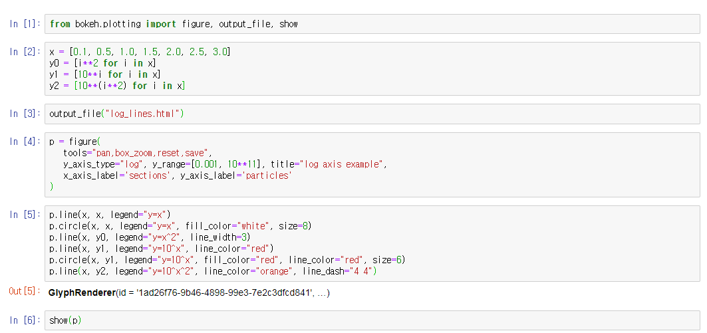
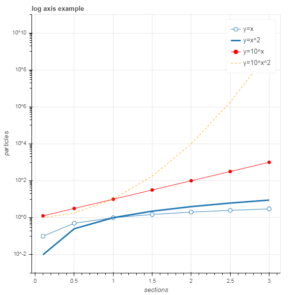

# Bokeh [](https://docs.bokeh.org/en/latest/index.html)

Bokeh(보케) is an `interactive` visualization library that targets modern web browsers for presentation.

### Install

```bash
$ conda install bokeh
```

- png, svg 만으로 뽑을 수 있는 것이 아니고, html로 뽑을 수도 있다. jupyter notebook에서 그림을 확인하면서 진행.

```js
>>> p.output_backend = "svg" // 출력방식을 변경
>>> export_svgs(p, filename="xxx.svg") // 파일로 추출
```

```js
>>> output_file("xxx.html") // 결과 파일을 html 형태로 정의
```

- jupyter notebook상에서 bokeh 설치 `!pip install bokeh`





- 다양한 시각화 유형 [](https://datavizproject.com/)

### Sample Data

```bash
$ bokeh sampledata
```

- `$HOME/.bokeh/data`에 다운로드 된다.

```js
>>> import bokeh.sampledata
>>> bokeh.sampledata.download()
```

### Server App Examples [](https://docs.bokeh.org/en/latest/docs/user_guide/server.html#userguide-server)

- python과 browser 간에 동기화하는 것이 Bokeh Server의 주요 목적이다.
- Bokeh application을 만든 후, bokeh serve 명령을 통해 Bokeh 서버는 응용 프로그램 코드를 사용하여 다음을 연결하는 모든 브라우저에 대한 세션과 문서를 작성하는 구조이다.
- Bokeh 서버(왼쪽)는 응용 프로그램 코드를 사용하여 BokehDocuments를 만들고, 브라우저(오른쪽)에서 연결할 때마다 Bokeh서버가 해당 세션에 대해서만 새 문서를 작성한다.
- 응용 프로그램 코드는 새로운 연결이 이루어질 때마다 Bokeh 서버에서 실행되어, 새로운 Bokeh를 생성한다. Document 브라우저에 동기화되며, 위젯 값과 같은 속성이 변경될 때마다 실행해야 하는 callback을 응용 프로그램 코드가 설정한다.


#### 응용 프로그램 제공 방법

##### [단일 모듈 형식]

```bash
$ bokeh serve --show xxx.py
```

- `--show` 옵션을 선택하면 브라우저가 실행 중인 응용 프로그램의 주소로 새 탭을 자동으로 열어준다. `http://localhost:5006/xxx`
- 응용 프로그램이 하나뿐이면 서버 root가 해당 응용 프로그램으로 redirection 되는데 그렇지 않으면, 서버 root에서 실행 중인 모든 응용 프로그램의 index를 볼 수 있다.
- `--disable-index` 옵션을 선택하면 redirection을 할 수 없게 한다.
- `--disable-index-redirect` 옵션을 사용하면, 단일 python 파일에서 Bokeh 응용 프로그램을 만드는 것 외에도 directory에서 응용 프로그램을 만들 수도 있다.

##### [디렉터리 형식]

- directory에는 최소한 pyBokehServer가 수행할 code가 구성되어 있어야 한다. `main.py`

```bash
$ bokeh serve --show [Diretory]
```

- 사용자 지정 변수는 다음을 통해 템플릿으로 전달할 수 있다.

```js
// set a new single key/value
curdoc().template_variables["user_id"] = user_id

// or update multiple at once
curdoc().template_variables.update(first_name="Mary", last_name="Jones")
```

[전체 파일 구조]

- myapp
	- main.py             // 수행할 code
	- server_lifecycle.py // 애플리케이션 생성의 다른 단계에서 선택적 콜백을 실행할 수 있는 파일
	- static			  // 응용 프로그램과 연결된 정적 리소스를 서비스하는 데 사용할 수 있는 하위 디렉토리
	- theme.yaml          // Bokeh 모델 유형에 적용할 기본 특성을 기준으로 정의하는 파일
	- templates
 		- index.html      // 하위 디렉터리 Jinja template file
